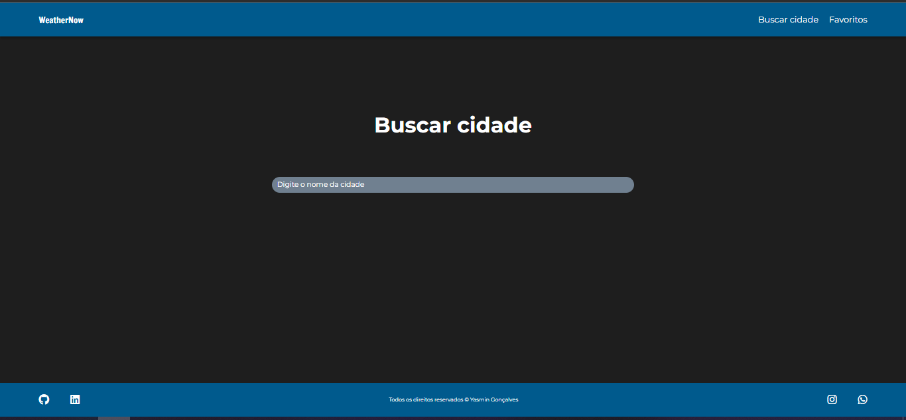

# Weather Now

Nesse site você pode consultar o clima com detalhes de qualquer cidade do **mundo**, e adicionar suas cidades favoritas à lista de favoritos!

[Clique aqui](https://weather-now-delta.vercel.app/) para acessar o site.

[Clique aqui](https://www.figma.com/file/BkrLUQnZGtHeQ1tTwJ9SE0/Clima?type=design&node-id=0-1&t=iKASAEVCSzopAQ2R-0) para ver o Figma.

---

## Tecnologias utilizadas:
- HTML5
- CSS3
- JavaScript
- Figma
- Consumo de APIs
- Rotas
- WebComponents

Foi utilizada a API [OpenWeather](https://openweathermap.org/api) para consultar o clima em tempo real.

---

## Autora

 - [Yasmin Gonçalves](https://github.com/yasmingcv)